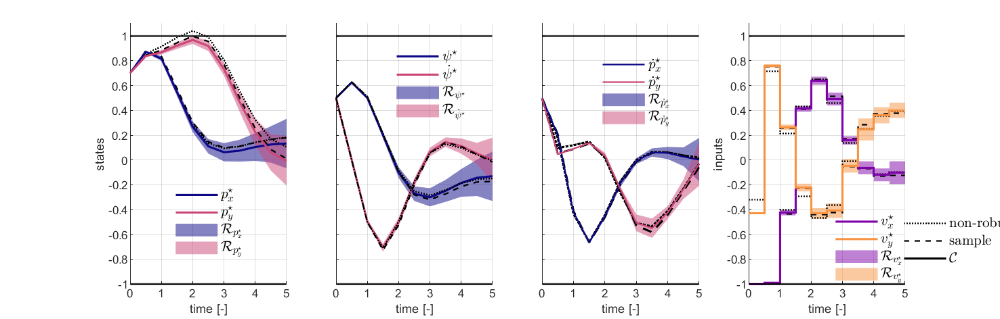

# Robust optimal control for nonlinear systems with parametric uncertainties via system level synthesis.
This repository contains the MATLAB code that accompanies the research paper:
> Leeman AP., Sieber J., Bennani S., Zeilinger MN. “Robust optimal control for nonlinear systems with parametric uncertainties via system level synthesis.” 
> Accepted CDC2023 (2023)



The paper is freely available on [arXiv](https://arxiv.org/abs/2304.00752).

## Prerequisites
- MATLAB (tested with version R2020b)
- Casadi

## Installation
1. Download and install MATLAB from the [official website](https://www.mathworks.com/products/matlab.html).

2. Install Casadi by following the instructions from the [official Casadi documentation](https://web.casadi.org/get/).
    
3. Clone this repository or download the code as a ZIP archive and extract it to a folder of your choice.

4. Add the code folder to your MATLAB path by running the following command in the MATLAB Command Window:
    
        addpath('/path/to/your/code/folder');
    
## Usage

Run the main script (i.e., main.m) to execute the algorithms and models discussed in the paper.

## License

This project is licensed under the MIT License.

## Citation

If you use this code in your research, please cite our paper:
  ```
  @inproceedings{leeman2023_CDC,
  title={Robust Optimal Control for Nonlinear Systems with Parametric Uncertainties via System Level Synthesis},
  author={Leeman, Antoine P. and Sieber, Jerome and Bennani, Samir and Zeilinger, Melanie N.},
  booktitle = {Proceedings of the 62nd IEEE Conf. on Decision and Control (CDC)},
  note = {forthcoming},
  archivePrefix = {arXiv},
  eprint = {2304.00752},
  year={2023}
  }
  ```
  

## Support and Contact

For any questions or issues related to this code, please contact the author:

- Antoine Leeman: aleeman(at)ethz(dot)ch

We appreciate any feedback, bug reports, or suggestions for improvements.
